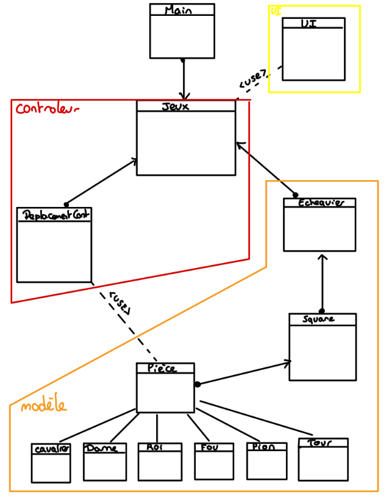

# Projet-POO

Projet de Loïc Herlin 

## UML 

Afin d'ajouter de la visibilité, j'ai créé un diagramme UML que voici :



## Conception

Pour concevoir mon échiquier en MVC, j'ai récupéré quelques morceaux de code recommandé et j'ai créé ma propre version. Dès le départ, j'ai cherché à intégrer mes pièces dans les différentes cases de l'échiquier (désolé pour la mauvaise orthographe du nom de ma classe ^^). J'ai ensuite travaillé sur un affichage correct et implémenté les fonctions de base de mes déplacements. J'ai ensuite ajouté les déplacements spécifiques à mes pièces avant de suivre les niveaux demandés (1, 2, 3 et 4) pour la suite. Même si j'ai rencontré quelques interactions non volontaires, je n'ai pas eu de difficulté particulière, mais j'ai mis plusieurs jours à tout finaliser (il y avait beaucoup de choses à implémenter). Cependant, je n'ai pas réussi à résoudre la seule difficulté qui est l'échec et mat, ainsi que le pat, où j'aurais aimé réduire la complexité du calcul. Mon code est entièrement commenté avec une documentation Doxygen.

# Compilation / lancement

Pour compiler le programme, veuillez vous rendre dans le repertoire racine du projet puis executez la commande make.
```
make
```
Pour compiler la documtation, executez la commande suivante depuis le repertoire racine :
```
doxygen Doxyfile 
```
Pour consulter la documentation, executez la commande suivante depuis le repertoire racine :
```
firefox docs/html/index.html 
```
Pour lancer le programme, executez la commande suivante depuis le repertoire racine :
```
./bin/echecs
```
Pour lancer les testes, executez les commandes suivante depuis le repertoire racine :
```
make
cd test
./test-level.sh 1 ../bin/echecs
./test-level.sh 2 ../bin/echecs
./test-level.sh 3 ../bin/echecs
./test-level.sh 4 ../bin/echecs
```
Mon programme passe l'ensemble des testes
